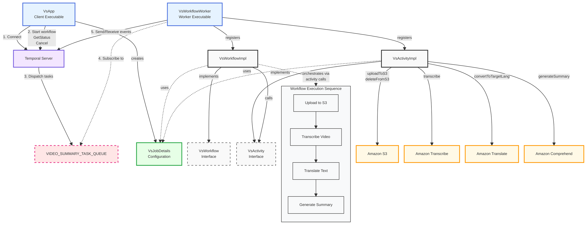

# Video Summary Application - Component Diagram

Architecture overview of the Temporal video summary application

## Component Architecture

## Component Overview

### Executables
- **VsApp**: Client executable that connects to the Temporal server and can send commands such as Start workflow, Cancel, GetStatus, etc.
- **VsWorkflowWorker**: Worker executable that connects to the Temporal server and subscribes to `VIDEO_SUMMARY_TASK_QUEUE`, sending and receiving events to orchestrate workflow execution

### Temporal Components
- **Temporal Server**: Orchestration engine that manages workflow execution, task queues, and state
- **Task Queue**: `VIDEO_SUMMARY_TASK_QUEUE` - Communication channel between the Temporal server and workers

### Workflow Components
- **VsWorkflow**: Interface defining the workflow contract with `getVideoSummary` method
- **VsWorkflowImpl**: Implementation that orchestrates the video processing activities with error handling and compensating actions

### Activity Components
- **VsActivity**: Interface defining the available activities
- **VsActivityImpl**: Implementation that performs the actual video processing work
- **Activities**:
  - `uploadToS3`: Uploads video file to S3 storage
  - `transcribe`: Transcribes video to text
  - `convertOriginalTextToTargetLanguage`: Translates text
  - `generateSummary`: Creates a summary from the translated text
  - `deleteFromS3`: Compensating action to remove files if needed

### Data Models
- **VsJobDetails**: Configuration record that contains:
  - Video URL
  - Original language
  - Target language
  - AWS credentials and configuration
- **VsSharedKeys**: Contains shared constants including task queue names

### External Services
- **Amazon S3**: Storage for video files and transcription results
- **Amazon Transcribe**: Speech-to-text service for video transcription
- **Amazon Translate**: Translation service for converting text between languages
- **Amazon Comprehend**: Text analysis service used for generating summaries

## Key Interactions

### 1. Client-Server Communication
- Client executable (`VsApp`) connects to the Temporal server
- Client sends commands like Start workflow, GetStatus, or Cancel to the Temporal server
- Client creates the `VsJobDetails` with configuration parameters for the workflow

### 2. Worker-Server Communication
- Worker executable (`VsWorkflowWorker`) connects to the Temporal server
- Worker subscribes to `VIDEO_SUMMARY_TASK_QUEUE`
- Worker sends and receives events to/from the Temporal server
- These events orchestrate the execution of activities in the workflow

### 3. Workflow Execution
- Workflow implementation (`VsWorkflowImpl`) controls the execution flow
- Activity implementation (`VsActivityImpl`) performs the actual work:
  - Uploading the video to S3
  - Transcribing the video using Amazon Transcribe
  - Translating the text using Amazon Translate
  - Generating a summary using Amazon Comprehend
  - Performing compensating actions (deleting from S3) if needed

## Fault-Tolerance Features
- **Retry Options**: Configures automatic retry of failed activities with exponential backoff
- **Activity Timeouts**: Different timeouts for standard vs. video processing activities
- **Compensating Actions**: If steps fail after S3 upload, the application tries to clean up by deleting the files
- **State Persistence**: Temporal maintains workflow state, allowing recovery from worker failures
