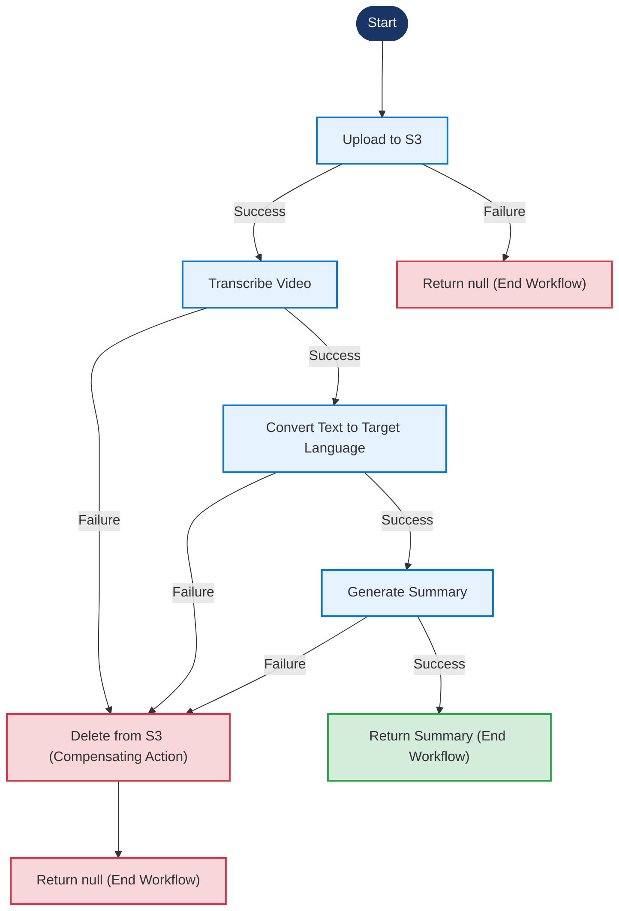

# VsWorkflowImpl Workflow Diagram

A visual representation of the Temporal video summary workflow implementation

## Workflow Process

## Workflow Configuration

### Retry Options
- **Initial Interval:** 1 second
- **Maximum Interval:** 30 seconds
- **Backoff Coefficient:** 2 (exponential backoff)
- **Maximum Attempts:** 10

### Default Activity Options
- **Start to Close Timeout:** 15 minutes
- **Schedule to Close Timeout:** 30 minutes
- **Heartbeat Timeout:** 15 minutes

### Video Processing Options
- **Start to Close Timeout:** 30 minutes
- **Schedule to Close Timeout:** 45 minutes
- **Heartbeat Timeout:** 30 minutes
- **Applied to:** uploadToS3, transcribe

## Implementation Details

- **Implementation Class:** `VsWorkflowImpl`
- **Interface:** `VsWorkflow`
- **Main Method:** `getVideoSummary(VsJobDetails jobDetails)`

## Workflow Steps

### 1. Upload to S3
Uploads the video file to Amazon S3 storage for processing.

**Error Handling:**
If upload fails, the workflow ends and returns null without compensating action.

### 2. Transcribe Video
Transcribes the uploaded video to text using the configured transcription service.

**Error Handling:**
If transcription fails, the workflow attempts to delete the uploaded file from S3 as a compensating action.

### 3. Convert Text to Target Language
Translates the transcribed text to the target language specified in the job details.

**Error Handling:**
If translation fails, the workflow attempts to delete the uploaded file from S3 as a compensating action.

### 4. Generate Summary
Creates a concise summary of the translated text.

**Error Handling:**
If summary generation fails, the workflow attempts to delete the uploaded file from S3 as a compensating action.

### 5. Compensating Action (if needed)
Deletes the video file from S3 storage if any step after upload fails.

**Error Handling:**
If deletion from S3 fails, an exception is thrown.
